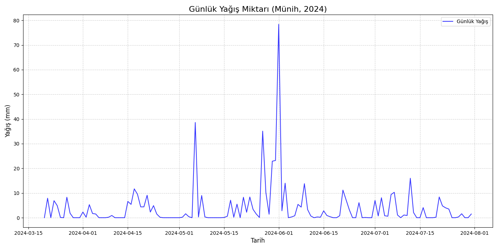
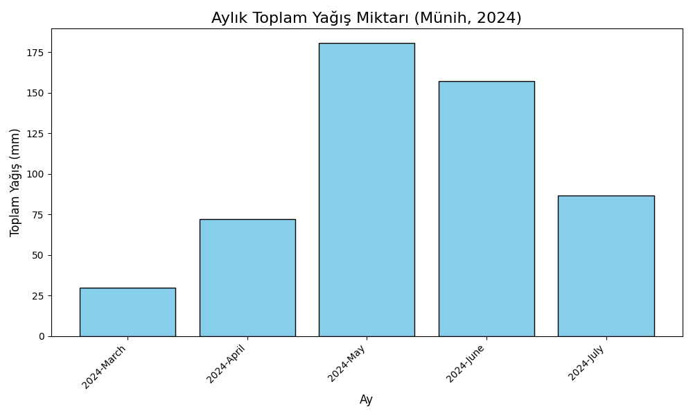

# Hava Durumu Analizi ☁️

Bu proje, Münih (Munich) şehri için 2024 yılına ait yağış verilerini analiz eder. `munich.csv` dosyasındaki ham verileri işleyerek günlük ve aylık bazda yağış miktarını görselleştirir.

## 📊 Analiz Görselleri

Proje, `main.py` betiği çalıştırıldığında `images/` klasörüne aşağıdaki iki ana görseli oluşturur:

---

### 1. Günlük Yağış Zaman Serisi (Mart - Ağustos 2024)

Bu zaman serisi grafiği, 2024 yılı Mart ve Ağustos ayları arasındaki günlük yağış miktarının (mm) dağılımını gösterir. Grafik, özellikle Mayıs sonu ve Haziran başında yaşanan ani ve yoğun yağış piklerini net bir şekilde ortaya koymaktadır.



---

### 2. Aylık Toplam Yağış Miktarı (Mart - Temmuz 2024)

Bu bar grafiği, Mart-Temmuz 2024 dönemi için aylık toplam yağış miktarlarını karşılaştırmalı olarak özetler. Analize göre **en yağışlı ayın açık ara Mayıs** (yaklaşık 180 mm) olduğu, onu Haziran ayının takip ettiği görülmektedir.



---

## 🚀 Kurulum ve Çalıştırma

Projeyi yerel makinenizde çalıştırmak için aşağıdaki adımları izleyin:

1.  **Depoyu klonlayın:**
    ```bash
    git clone [https://github.com/enesbilgin0/Hava-Durumu-Analiz.git](https://github.com/enesbilgin0/Hava-Durumu-Analiz.git)
    cd Hava-Durumu-Analiz
    ```

2.  **Gerekli Python kütüphanelerini yükleyin:**
    Bu proje **Pandas** (veri işleme için) ve **Matplotlib** (görselleştirme için) kütüphanelerini kullanır.
    ```bash
    pip install pandas matplotlib
    ```

3.  **Betiği çalıştırın:**
    Analizi başlatmak ve yukarıdaki görselleri `images/` klasörüne oluşturmak için:
    ```bash
    python main.py
    ```

## 📦 Veri Seti

Analizde kullanılan `munich.csv` dosyası, Münih şehrine ait tarihsel hava durumu kayıtlarını içermelidir. Betiğin doğru çalışabilmesi için veri setinde en azından bir tarih sütunu (zaman serisi analizi için) ve bir yağış miktarı sütunu (mm cinsinden) bulunmalıdır.
